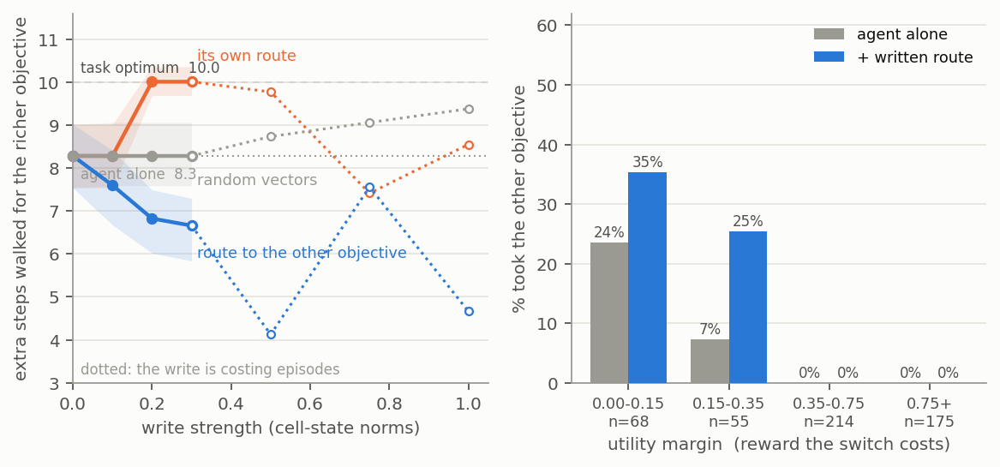

# Experiment 1 — Toy Model Building

## Tldr Takeaway

Built the toy model. A DRC(3,3) agent on an 11×11 two-objective maze weighs value against distance, and that trade-off is linearly readable from its recurrent state and writable back into it.

The write moves the trade-off in both directions and says by how much. Left alone the agent walks 8.3 extra steps for the richer objective where the task pays 10.0; writing the route to the other objective pulls it to 6.7, writing its own route pushes it to exactly 10.0. Both at 100% reach.

Also ran a first, deliberately crude goal misgeneralisation: a channel correlated with value at training, swept at test. The proxy is learnt after competence, not alongside it.

## Initial Aim/Hypotheses 

Building small toy models that cleanly isolate key features of model behaviour seems a useful way to test broader hypotheses about training and behaviour as this project goes on. A sort of "model-organism" of goal misgeneralisation. E.g. [Toy Models of Superposition](https://transformer-circuits.pub/2022/toy_model/index.html), [Nanda et al. grokking/progress measures](https://arxiv.org/abs/2301.05217).

In the literature there are some simple mechanistic examples of goals being isolated/goal misgeneralisation: [[Mini2023_MazePolicy]].

Also some clean examples of planning circuits being isolated in models: [[Bush2025_EmergentPlanning]], and some interesting follow up papers and blog posts [Taufeeque et al. 2024 (arXiv)](https://arxiv.org/abs/2407.15421).

My goal here is to cleanly isolate competing goals in a model. i.e. a mechanism that weighs up two or more different objectives and can be intervened on to make the model switch from one target to another.

~achieved. The mechanism is there, readable and writable, though the intervention is partial. The write is followed where switching is cheap and refused where it is not.

## Setup/Task Details

DRC(3,3) -- ConvLSTM, 3 layers × 3 ticks per env step -- trained with IMPALA (cleanba, unmodified), γ=0.995. The DRC architecture is [Guez et al. 2019](https://proceedings.mlr.press/v97/guez19a.html), designed with the intent of cleanly producing planning.

11×11 maze, two objectives, episode ends on reaching either. Reward is the objective's value minus 0.05 per step, so **utility = value − 0.05 × distance** and the nearer objective often wins. 120-step limit.

Observation is symbolic 11×11×5. ch0 walls, ch1 agent, ch2 feature 0, ch3 feature 1, ch4 value.

ch2 and ch3 exist so I can directly create an explicit spurious correlation. The task would work with ch4 alone. It seems more interesting to indirectly force a correlation and have the proxy goal be something the agent comes up with but I use this direct setup as a starting point.

1M pre-generated levels, test/train/valid = 50k/900k/50k, disjoint. All numbers below are the test split, held out from training *and* from in-training eval.

**ρ = P(feature 0 marks the higher-value objective).** Fixed during training and swept at test: ρ=1.0 makes the channel a perfect cue, 0.5 is chance, 0.0 inverts it.

Four agents. A **5×5 smoke test** (10M steps) to check the stack works, then three 11×11 runs at 130–150M steps: the **proxy run**, trained at ρ=1.0 so colour perfectly predicts which objective is richer, and two **controls** at ρ=0.5 where colour says nothing — one with the same fixed values, one with values redrawn each episode so that a probe has something to regress against. Referred to below by those names; on the data volume they are `smoke5b`, `maze11`, `clean11fv` and `clean11`.

*Figure 1: the task and its symbolic encoding. Left: the rendered maze, never passed to the agent. Right: the five observation channels. Here feature 0 is worth 1.0 at 11 steps and feature 1 is worth 0.5 at 4 steps, so feature 0 is the optimal choice.*

## Results

### Verify setup works

Trained successfully to maximise reward on a 5x5 and 11x11 maze. All four runs reach an objective 100% of the time, and the ρ=0.5 control picks the higher-utility one 95% of the time at every ρ.

Linear probes successfully extracted plans. The agent learns to plan to move to the further away objective if reward is high enough. A linear 1×1 conv on the recurrent state at t=0, predicting which cells the agent will later step on:

| run | linear probe on activations | linear probe on observation (control) |
|---|---|---|
| 5×5 smoke test | 0.993 | 0.871 |
| proxy run | 0.967 | 0.583 |
| control, fixed values | 0.910 | 0.582 |
| control, random values | 0.916 | 0.600 |

*Figure 2: probe scores at t=0 on four test levels, with the route actually taken overlaid. The agent walks past the nearer objective when the further one is worth more (left two panels) and takes the nearer one when it is not (right two).*

Probes can be written back as well as read. I take the route as a 5-class direction per cell (up/down/left/right/never), fit a linear 1×1 probe on the ConvLSTM cell state, and write its class vectors back into that cell state before every step. My mazes are perfect, so there is no second route to divert onto as in Bush's shortcut; instead I write the route to the objective the agent is *not* taking. The ρ=0.5 control, 512 test episodes per arm, at the largest write that costs no competence:

| write | took the other objective | reached |
|---|---|---|
| none | 3.9% | 100% |
| route to the other objective | 7.4% | 100% |
| its own route (control) | 0.0% | 100% |
| same plan, wrong maze (control) | 5.1% | 99.8% |
| random vectors (control) | 4.0% | 98.8% |

Writing its own route back removes its mistakes entirely, and split by utility margin (figure 3, right) the write enters the decision rather than overriding it followed when it is cheap, refused when it is expensive.

Fitting the point at which the agent gives up on the richer objective, it will walk 8.3 extra steps for it; the task's reward structure says it should walk 10.0, so it over-values distance behaving as though a step cost 0.060 rather than 0.05 and this is where its remaining 4% of wrong choices comes from. Writing the other route drops that to 6.7 steps, and writing its own route raises it to 10.0 both with the agent still reaching an objective 100% of the time, and neither interval overlapping the baseline.

*Figure 3: left, the same write at increasing strength. The route to the other objective pulls the exchange rate down, the agent's own route pushes it up to the task optimum, and norm-matched random vectors move it nowhere. Bands are 95% intervals; dotted past the point where the write starts costing the agent episodes, which is where the numbers stop meaning a shifted trade-off. Right, % taking the other objective by utility margin the write is followed where switching is cheap and refused where it is not.*

### Summary of Initial Simple Misgeneralisation Experiment

A direct, explicit proxy objective: train at a fixed ρ, then sweep ρ at test.

2,048 episodes per arm:

*Figure 4: left to right -- 5x5 and 11x11 trained at ρ=1.0 (feature 0 always marks the higher-value objective), then 11x11 control trained at ρ=0.5 (channel varied randomly).*

The control is on the right hand side, trained with the channel randomised.

*Figure 5: % chose optimal by utility margin, on identical levels. The control is flat across ρ in every band; the proxy run loses 64 points in the 0.15–0.35 band and 31 on the easiest decisions.*

Interestingly in the 11x11 maze the model learns to complete the task optimally before it learns the direct proxy. See figure 6 below.

*Figure 6: returns hide the effect — the three test correlations are indistinguishable. Subtracting them, the proxy run's ρ=1.0 − ρ=0.0 gap settles at +0.165 and the control's at −0.001, and neither moves before competence at ~20M. From cleanba's in-training eval, so only the within-run gap is comparable.*

---
## Links
[[4YP Working Notes]] · [[4YP Literature Hub]] · [[Bush2025_EmergentPlanning]] · [[Mini2023_MazePolicy]]
