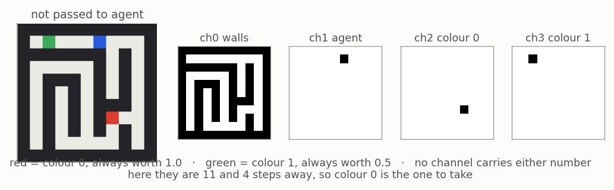
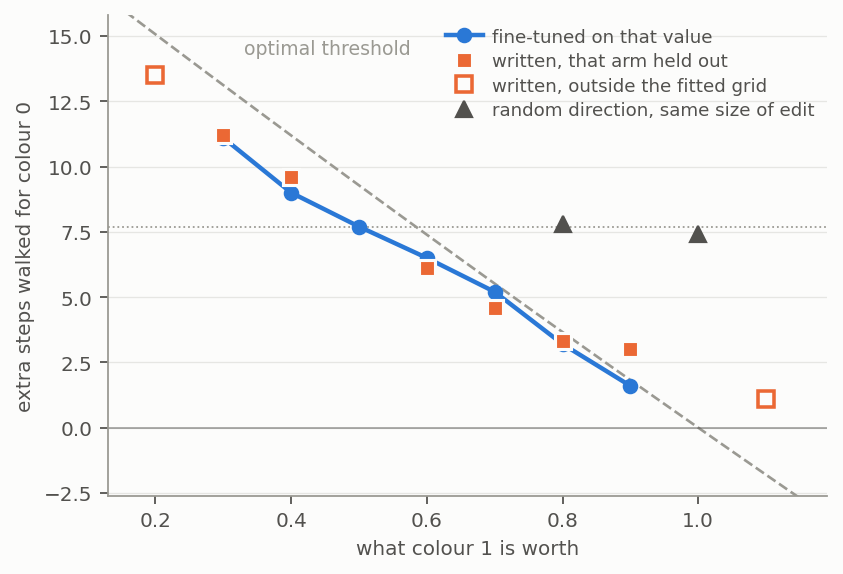

# Experiment 2 — Utility Threshold

## Tldr takeaway

Found a writable, readable one-dimensional utility threshold, not a per-objective 
value register. Raising either objective's value moves the same weights in
opposite directions ($\cos = -1.00$), so what the fine-tunes are moving is a threshold 
on the difference in distances. 

Also tried to see if weight updates were concentrated. Found higher density in channel 1 and 7
as well as reccurence cell 0 but restricting to just these updates hurt performance significantly.

Trained an evenly-spaced three-objective task, which produces one dimension; an unevenly-spaced 
one produces a second, but it takes only 16% of the variance.

## Initial aim / hypotheses

Find a value register I can intervene on.

~achieved. Found a threshold instead

## Setups / details

Trained in the maze with the following inputs

*Figure 1: what the agent sees. Four channels passed in walls, the agent, and one per
objective. In the rendered maze on the left,
blue is the agent, red is colour 0 at 11 steps away and green is colour 1 at 4.
In this case colour 0 is worth the walk.

Fine-tune the same agent onto a grid of values for one objective,
then fit.

$$\Delta\theta_i \;=\; \mathrm{drift} \;+\; o_i\,\mathrm{axis} \;+\; \varepsilon_i$$

across the grid, where $o_i$ is arm $i$'s offset from the base value and
$\varepsilon_i$ is whatever is left. Test on an unused grid entry

I ran a second seed of this training an otherwise identical agent and reproing results on it.

I also ran two versions with three objectives.

Three objectives. (1.0, 0.65, 0.3) at 80M steps, then a redesign at
(1.0, 0.55, 0.4), also 80M. 

## Results

### Weight Changes Observed
 
Every arm ends up about the same distance from the base:  
$\lVert\Delta\theta\rVert = 14.7 \pm 0.36$

(including the null arm at 14.4 which did not change behaviour) 

Splitting each arm by squared magnitude, as a share of $\lVert\Delta\theta\rVert^2$:

| $o_i$ | drift | axis | $\varepsilon$ | cross |
|---|---|---|---|---|
| −0.2 | 37% | 15% | 35% | +13% |
| +0.2 | 38% | 15% | 62% | −14% |
| +0.4 | 33% | 54% | 37% | −24% |

$\lVert\mathrm{drift}\rVert = 8.9$ and is near-identical across arms;
$\lVert\mathrm{axis}\rVert = 28.5$ per unit of value, so the axis part of an
arm at offset $0.2$ is only $5.7$, and it only overtakes everything else at the
wide end of the grid.

The columns are the four terms of

$$\lVert\Delta\theta_i\rVert^2 \;=\; \lVert\mathrm{drift}\rVert^2
\;+\; o_i^2\lVert\mathrm{axis}\rVert^2 \;+\; \lVert\varepsilon_i\rVert^2
\;+\; 2o_i\,(\mathrm{drift}\cdot\mathrm{axis})$$

and they do not sum to 100% because drift and the axis are not orthogonal:
$\cos(\mathrm{drift}, \mathrm{axis}) = -0.29$. That last term is the cross
column. It is linear in $o_i$, so it flips sign with the offset and cancels
across a balanced grid; the fitted axis is unaffected. $\varepsilon$ is
orthogonal to both to within $\pm 0.02$.

$\varepsilon$ never becomes small. Even at the widest offset, where
the axis is finally the majority of the movement, better than a third of that
arm is still noise. One arm cannot show you the axis.

Seed 5678's arms ran 750k steps rather than 3M and everything is smaller:
$\lVert\Delta\theta\rVert \approx 7$, drift $3.9$, axis $16.4$. Shorter fine-tunes are cleaner: split-half
reliability 0.27–0.29 against 0.14 here, and seed 1234's own 750k arms sit
between at 0.23 — so it is the length doing it rather than the seed.

### Writing a value works

Applying the axis to the non finetuned weights produces the desired behaviour,
at 100% reach throughout, and norm-matched random directions of the same length
do nothing.

Figure 2: writing a value into the unedited agent. Each written point comes
from an axis fitted on the other five arms, so nothing about the arm it predicts
went into the direction that produces it. The dotted line is the
unedited agent.

It fails at $v = 1.1$, where colour 1 is worth more than colour 0 and the agent
should flip preference outright. It does not. The map is locally linear, not
globally.

Both held-out writes replicate on seed 5678, less cleanly: mean error 0.77 steps
against 0.53, and every error the same sign rather than scattered around zero.
Its axis systematically overshoots, worst at both ends of the grid — the
signature of fitting a straight line to something slightly curved, and the same
thing that shows up as the failure at $v = 1.1$.

### Where in the weights — reliable, and about one network only

The change concentrates in the input-to-hidden convolution of recurrent layer 0,
and within it in two of the 32 channels: ch07 at 2.29× and ch01 at 2.21× the
shared fine-tuning component, then a gap down to 1.31 for everything else.

That measurement is reliable. The colour-0 and colour-1 sweeps are disjoint sets
of arms and agree on the channel profile at $r = +0.97$, sharing 7 of their top 8
channels against 2 by chance.

The answer is not. On seed 5678 the leaders are ch15, ch04, ch25, ch16 —
flatter, no gap — and neither ch07 nor ch01 appears anywhere in its top eight.
Across seeds the overlap is 3 of 8 against 2 by chance, i.e. nothing, while
within that seed the two sweeps still agree at $r = +0.79$. So the method
replicates and the localisation does not: *the value lives in channels 1 and 7*
is a fact about novalue11, not about the architecture or the task.

Reading and writing also come apart. Restricting the fit to those 9,216
parameters takes reading from slope 0.03 to 0.55 — most of the value-carrying
signal really is in there. Writing only there gives 6.8 steps against a base of
7.7, where the full axis gives 2.4 — almost nothing. Concentrated enough to read
from, too distributed to write from, which is [[Hase2023_LocalizationEditing]]
turning up in our own data rather than borrowed.

The harder negative: ablating those channels in the untouched agent does nothing
beyond a random pair, and they rank 15th and 30th of 32 at predicting which
objective it takes. The channels that do predict the decision are equally inert
when ablated. What a fine-tune moves is not what the agent reads.

### threshold not value store

$\boldsymbol{\cos(\mathrm{axis}_0, \mathrm{axis}_1) = -1.00 \pm 0.03}$, at every channel subset and in both gate
convolutions, with the arm counts matched on both sides of the comparison.
Raising colour 0's value and raising colour 1's move the same weights in exactly
opposite directions.
 

### Three objectives: structure forms only as far as it is forced

|  | (1.0, 0.65, 0.3) | (1.0, 0.55, 0.4) |
|---|---|---|
| gaps | 0.35, 0.35 — even | 0.45, 0.15 |
| thresholds / rank gaps | 7, 7 steps over 1, 1 | 9, 3 steps over 1, 1 |
| can one constant express it? | **yes** | **no** |
| $\cos(\mathrm{axis}_1, \mathrm{axis}_2)$ | +0.93 | **+0.53** |
| variance in 2nd dimension | 3% | **16%** |
| base agent chose optimal | 87.4% | 92.2% |

With $\rho = 1$ the colour channels hand over the *ordering* for free, so what has to
be stored is the magnitudes. Evenly spaced values make every threshold a rank
gap times one constant, so a single stored number solves the task — and a short
fine-tune can only move the number that exists. That is the whole explanation
for three collinear axes, and it is a fact about the task rather than the agent.

On the redesign the second dimension appears but does not take over. The
structure is hierarchical: $\mathrm{axis}_1$ lies 93% along the dominant
direction and $\mathrm{axis}_2$ 81%, with their off-axis parts **opposed** —
which predicts $\cos(\mathrm{axis}_1, \mathrm{axis}_2) = 0.530$ against
$0.534$ observed (aligned would give $0.968$).
The 84/16 split tracks how often each comparison decides an episode: predicted
ratio 1.59, observed 1.60.

*That last figure is $n = 1$ and the model was built after seeing the numbers.
Agreement to two decimals is better than the data deserve.*

### Behavioural evidence for the projection account

If the agent has one dial and the fine-tune tasks need two, arms should be
measurably worse at their own task the further its values sit from an arithmetic
progression. Controlling for difficulty — how far ahead the best objective is,
which dominates at $r = +0.85$ — they are:

$$\begin{aligned}
\text{grid 1:}\quad \text{optimal} &= 80.7 + 22.7\,\text{topgap} - \phantom{0}9.0\,\text{asymmetry},
  &\text{partial } r &= -0.59\\
\text{grid 2:}\quad \text{optimal} &= 86.3 + 14.9\,\text{topgap} - 11.5\,\text{asymmetry},
  &\text{partial } r &= -0.41
\end{aligned}$$

The second was **pre-registered**: the model, the sign, the order of magnitude
and which term would be larger were all written down before that grid finished
training. Asymmetry alone is null in both, which is why the covariate is needed.

This test touches no weight-space quantity, so it is independent of every
estimator in the rest of the experiment.

## Links

[[4YP Working Notes]] · [[4YP Literature Hub]] · [[4YP Experiment 1 - Toy Model Building]] · [[Bush2025_EmergentPlanning]] · [[Hase2023_LocalizationEditing]]
