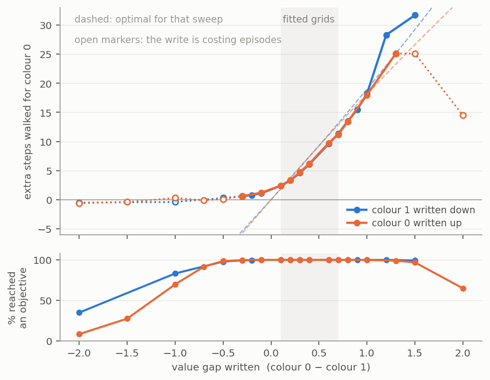

# Experiment 2 — Utility Threshold

## Tldr takeaway

Found a writable, readable one-dimensional utility threshold, not a per-objective value register. Raising either objective's value moves the same weights in opposite directions ($\cos = -1.00$), so what the fine-tunes are moving is a threshold on the difference in distances.

Also tried to see if weight updates were concentrated. Found higher density in channel 1 and 7 as well as reccurence cell 0 but restricting to just these updates hurt performance significantly.

Trained an evenly-spaced three-objective task, which produces one dimension; an unevenly-spaced one produces a second, but it takes only 16% of the variance.

## Initial aim / hypotheses

Find a value register I can intervene on.

~achieved. Found a threshold instead

## Setups / details

Trained in the maze with the following inputs

Figure 1: what the agent sees. Four channels passed in walls, the agent, and one per objective. In the rendered maze on the left, blue is the agent, red is colour 0 at 11 steps away and green is colour 1 at 4. In this case colour 0 is worth the walk.

Fine-tune the same agent onto a grid of values for one objective, then fit.

$$\Delta\theta_i \;=\; \mathrm{drift} \;+\; o_i\,\mathrm{axis} \;+\; \varepsilon_i$$

across the grid, where $o_i$ is arm $i$'s offset from the base value and $\varepsilon_i$ is whatever is left. Test on an unused grid entry

I ran a second seed of this training an otherwise identical agent and reproing results on it.

I also ran two versions with three objectives.

Three objectives. (1.0, 0.65, 0.3) at 80M steps, then a redesign at (1.0, 0.55, 0.4), also 80M.

## Results

### Weight Changes Observed
 
Every arm ends up about the same distance from the base: $\lVert\Delta\theta\rVert = 14.7 \pm 0.36$

(including the null arm at 14.4 which did not change behaviour)

Splitting each arm by squared magnitude, as a share of $\lVert\Delta\theta\rVert^2$:

| $o_i$ | drift | axis | $\varepsilon$ | cross |
|---|---|---|---|---|
| −0.2 | 37% | 15% | 35% | +13% |
| −0.1 | 38% | 4% | 50% | +8% |
| +0.1 | 39% | 4% | 66% | −8% |
| +0.2 | 38% | 15% | 62% | −14% |
| +0.3 | 36% | 33% | 51% | −20% |
| +0.4 | 33% | 54% | 37% | −24% |
| 0.0, null arm | 38% | 0% | 95% | −33% |

Six arms are fitted. The null arm is held out of the fit — it is the drift measurement, so letting it into the fit would be circular — and its row is therefore out of sample, which is why its $\varepsilon$ swallows almost everything.

$\lVert\mathrm{drift}\rVert = 8.9$ and is near-identical across arms; $\lVert\mathrm{axis}\rVert = 28.5$ per unit of value, so the axis part of an arm at offset $0.2$ is only $5.7$, and it only overtakes everything else at the wide end of the grid.

The columns are the four terms of

$$\lVert\Delta\theta_i\rVert^2 \;=\; \lVert\mathrm{drift}\rVert^2
\;+\; o_i^2\lVert\mathrm{axis}\rVert^2 \;+\; \lVert\varepsilon_i\rVert^2
\;+\; 2o_i\,(\mathrm{drift}\cdot\mathrm{axis})$$

and they do not sum to 100% because drift and the axis are not orthogonal: $\cos(\mathrm{drift}, \mathrm{axis}) = -0.29$. That last term is the cross column. It is linear in $o_i$, so it flips sign with the offset and cancels across a balanced grid; the fitted axis is unaffected. $\varepsilon$ is orthogonal to both to within $\pm 0.02$.

$\varepsilon$ never becomes small.

Seed 5678's arms ran 750k steps rather than 3M and everything is smaller: $\lVert\Delta\theta\rVert \approx 7$, drift $3.9$, axis $16.4$. Shorter fine-tunes are cleaner: split-half reliability 0.27–0.29 against 0.14 here, and seed 1234's own 750k arms sit between at 0.23 so this is consistent.

### Writing a value works

Applying the axis to the non finetuned weights produces the desired behaviour, at 100% reach throughout, and norm-matched random directions of the same length do nothing.

Figure 2: Writing a value into the unedited agent (seed 1234). Each written point comes from an axis fitted on the other five arms, so nothing about the arm it predicts went into the direction that produces it. The dotted line is the unedited agent.

Both lines sit below the optimum everywhere, which is a property of the base agent rather than of the edit. At colour 1's base value of $0.5$ it walks $7.7$ extra steps for colour 0 where the optimum is $9.3$ — $83\%$ of it, behaving as though a step cost $0.061$ rather than $0.05$, so it gives up on the further objective too early. Seed 5678 sits closer at $8.5$ steps, $92\%$, an implied $0.055$. The slopes are the more alike of the two: $-15.2$ and $-15.6$ extra steps per unit of value against the optimum's $-18.8$, so $81\%$ and $83\%$. The agents differ more in where they sit than in how they trade.

The threshold drawn is the one the agent is trained against, which is discounted at $\gamma = 0.995$ rather than the $(v_0 - v_1)/0.05$ the task pays undiscounted. Setting the two discounted returns equal,

$$\gamma^{\,d_1 + \Delta}\,(c + v_0) \;=\; \gamma^{\,d_1}(c + v_1), \qquad c = \frac{0.05}{1-\gamma} = 10$$

so $\Delta = \ln\!\big((c+v_1)/(c+v_0)\big)/\ln\gamma$. Two things fall out. The distance already walked cancels, so the threshold depends on the two values alone and not on how far away anything is — short episodes do not bend it. And it is logarithmic rather than linear, sitting up to $0.9$ steps below the undiscounted line over this range, which is enough to matter for the percentages above. It ignores the 120-step timeout, which is a further penalty on distant objectives and would push the optimum down a little more.

Our intervention fails at $v = 1.1$, where colour 1 is worth more than colour 0 and the agent should flip preference outright. It does not. The map is locally linear, not globally.

Both held-out writes replicate on seed 5678, less cleanly: mean error 0.77 steps against 0.53, and every error the same sign rather than scattered around zero. Its axis systematically overshoots, worst at both ends of the grid (sort of what we see on the first seed).

### How far the axis carries

Writing far outside the fitted grid, in both directions and from both sweeps.
The x axis is the *gap* each write asks for, since moving colour 0 up by $\delta$
and colour 1 down by $\delta$ ask for the same thing.

Figure 3: both sweeps written well outside their grids. Dashed lines are the
optimal threshold for each sweep; open markers are writes that cost the agent
episodes, and the lower panel is why. The two fitted grids happen to cover the
same gap range, shaded.

Three things.

**The two sweeps land on top of each other.** At matched gaps: 2.4/2.4,
3.3/3.3, 6.1/6.2, 9.6/9.7, 11.3/11.2, 13.5/13.4, 18.2/18.0. Separately fitted
directions, separately written weights, agreeing to $0.2$ steps. That is a real
check on the estimator but *not* independent evidence about representation —
behaviour depends on the gap under either account, and
$\cos(\mathrm{axis}_0, \mathrm{axis}_1) = -1$ already says these are the same
edit. What it buys is range: together they cover a written gap of $-0.7$ to
$+1.3$ at full competence, against fitted grids spanning $0.1$ to $0.7$.

**Saturation depends on the direction of travel, not on which objective is
edited.** Pushed to deepen the preference the agent already has, the axis carries
roughly twice the fitted range and still tracks a curve it was fitted to as a
line. Pushed toward reversing it, both sweeps flatten at zero while the optimum
dives to $-33$. The map is locally linear, not globally, and the failure is
one-sided.

**The apparent flip is a broken agent.** The few negative readings come with
reach at $83\%$, $69\%$, $35\%$, $8\%$. Writing harder does not invert the
preference; it destroys the policy. Which is what a threshold predicts and a
per-objective value register does not: you can slide a threshold further out, but
making the comparison come out the other way is not a translation along the same
direction.

### Weight Changes Concentrated in Specific Channels

**Not reproduced in seed 5678. No clear gap between channels.**

The change concentrates in the input-to-hidden convolution of recurrent layer 0, and within it in two of the 32 channels: ch07 at 2.29× and ch01 at 2.21× the shared fine-tuning component, then a gap down to 1.31 for everything else.

The colour-0 and colour-1 sweeps are disjoint sets of arms and agree on the channel profile at $r = +0.97$, sharing 7 of their top 8 channels against 2 by chance.

However you can't only write using the weights in those channels. We don't see the threshold changing as we'd like.

### threshold not value store

$\boldsymbol{\cos(\mathrm{axis}_0, \mathrm{axis}_1) = -1.00 \pm 0.03}$, at every channel subset and in both gate convolutions, with the arm counts matched on both sides of the comparison. Raising colour 0's value and raising colour 1's move the same weights in exactly opposite directions.
 

### Three objectives: collapses onto a single axis

|  | (1.0, 0.65, 0.3) | (1.0, 0.55, 0.4) |
|---|---|---|
| gaps | 0.35, 0.35 — even | 0.45, 0.15 |
| thresholds / rank gaps | 7, 7 steps over 1, 1 | 9, 3 steps over 1, 1 |
| can one constant express it? | **yes** | **no** |
| $\cos(\mathrm{axis}_1, \mathrm{axis}_2)$ | +0.93 | **+0.53** |
| variance in 2nd dimension | 3% | **16%** |
| base agent chose optimal | 87.4% | 92.2% |

(hypothesised explanation) Evenly spaced values make every threshold a rank gap times one constant, so a single stored number solves the original task trained for. A short fine-tune can only adjust the circuitry that exists (not build a new threshold "axis" in).

On the redesign the second dimension appears but does not take over. The structure is hierarchical: $\mathrm{axis}_1$ lies 93% along the dominant direction and $\mathrm{axis}_2$ 81%, with their off-axis parts sitting opposite which predicts $\cos(\mathrm{axis}_1, \mathrm{axis}_2) = 0.530$ against $0.534$ observed (aligned would give $0.968$). The 84/16 split tracks how often each comparison decides an episode: predicted ratio 1.59, observed 1.60.

*That last figure is $n = 1$ and the model was built after seeing the numbers.*

### Behavioural evidence for the projection account

If the agent has one dial and the fine-tune tasks need two, arms should be measurably worse at their own task the further its values sit from an arithmetic progression. We observe this

## Links

[[4YP Working Notes]] · [[4YP Literature Hub]] · [[4YP Experiment 1 - Toy Model Building]] · [[Bush2025_EmergentPlanning]] · [[Hase2023_LocalizationEditing]]
