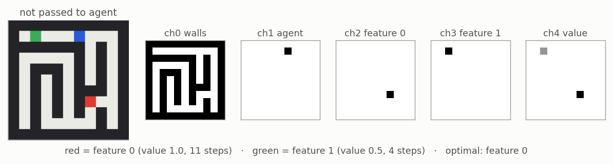
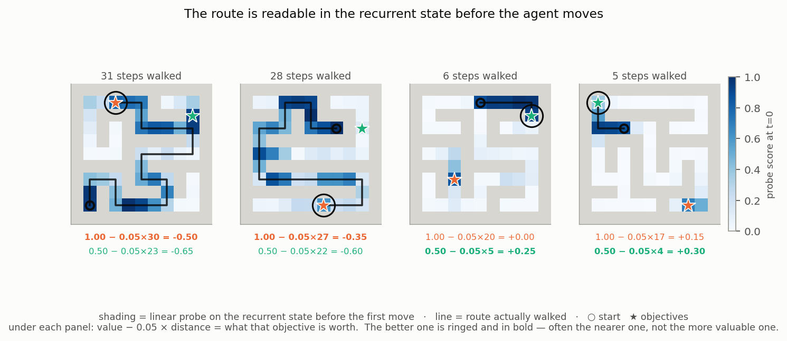
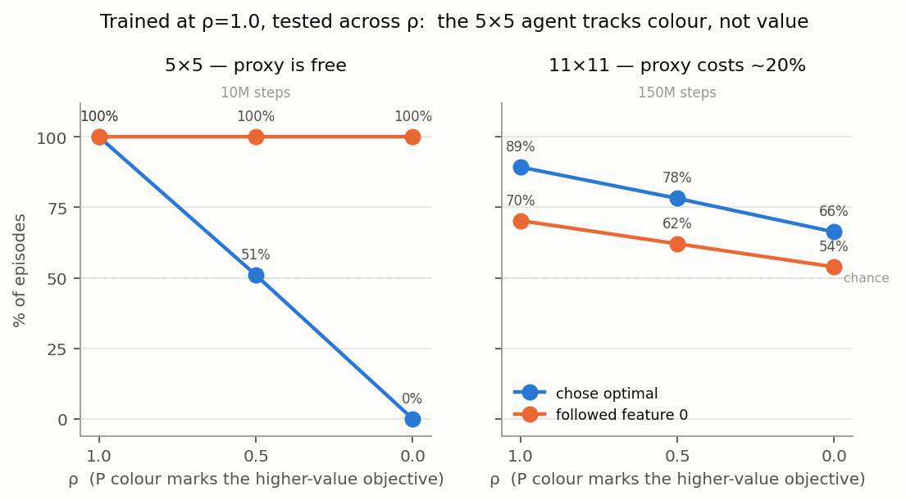
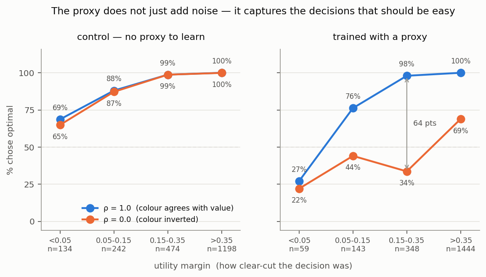
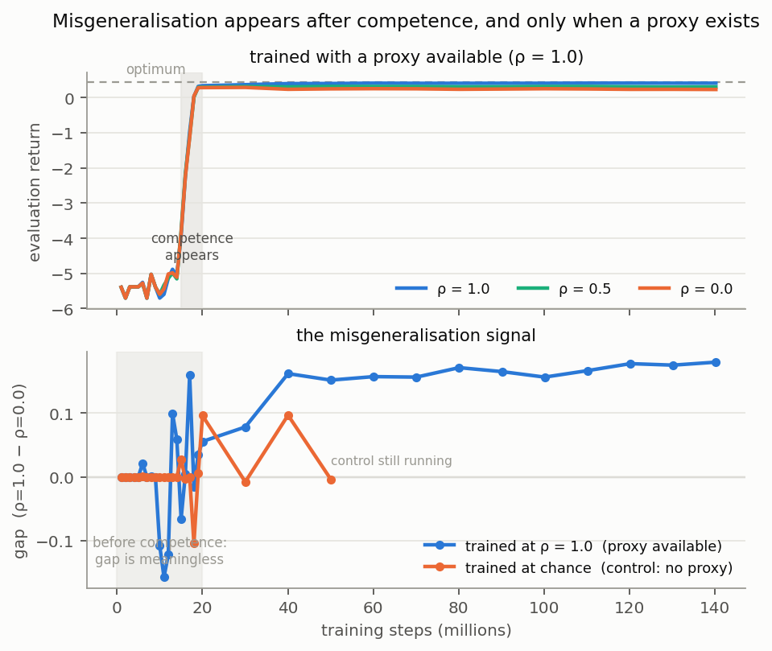

# Experiment Bush replication + extensions

## Goal

Building small toy models that cleanly isolate key features of model behaviour seems a useful way to test broader hypotheses about training and behaviour as this project goes on. A sort of "model-organism" of goal misgeneralisation. E.g. [Toy Models of Superposition](https://transformer-circuits.pub/2022/toy_model/index.html), [Nanda et al. grokking/progress measures](https://arxiv.org/abs/2301.05217).

In the literature there are some simple mechanistic examples of goals being isolated/goal misgeneralisation: https://arxiv.org/abs/2310.08043. 

Also some clean examples of planning circuits being isolated in models: (https://arxiv.org/abs/2504.01871 ). and some interesting follow up papers and blog posts [Taufeeque et al. 2024 (arXiv)](https://arxiv.org/abs/2407.15421).

My goal here is to cleanly isolate competing goals in a model. i.e. a mechanism that weighs up two or more different objectives and can be intervened on to make the model switch from one target to another.

## Tldr Plan

Maze navigation using a DRC agent seemed to give clean results here: https://arxiv.org/abs/2504.01871. Maze navigations seems simple to setup, has a clean ground truth and is easy to build multiple objectives into. So we replicate (Appendix C of [Tom Bush Blogpost](https://tuphs28.github.io/projects/interpplanning/)) and then extend to our multi-objective setup. 

## Setup/Task Details

### Environment / Agent Setup

DRC(3,3) -- ConvLSTM, 3 layers × 3 ticks per env step -- trained with IMPALA
(cleanba, unmodified) for 150M steps, γ=0.995. The DRC architecture is
[Guez et al. 2019](https://proceedings.mlr.press/v97/guez19a.html), designed with
the intent of cleanly producing planning.

11×11 maze, two objectives, episode ends on reaching either. Reward is the
objective's value minus 0.05 per step, so **utility = value − 0.05 × distance**
and the nearer objective often wins. 120-step limit.

Observation is symbolic 11×11×5. ch0 walls, ch1 agent, ch2 feature 0, ch3 feature 1, ch4 value.

ch2 and ch3 exist so I can directly create an explicit spurious correlation. The task would work with ch4 alone. It seems more interesting to indirectly force a correlation and have the proxy goal be something the agent comes up with but I use this direct setup as a starting point.

1M pre-generated levels, test/train/valid = 50k/900k/50k, disjoint. All numbers below are the test split, held out from training *and* from in-training eval.

*Figure 1: the task and its symbolic encoding. Left: the rendered maze, never passed to the agent. Right: the five observation channels. Here feature 0 is worth 1.0 at 11 steps and feature 1 is worth 0.5 at 4 steps, so feature 0 is the optimal choice.*

The four runs referred to in initial runs below:

| run | size | train ρ | values | steps |
|---|---|---|---|---|
| `smoke5b` | 5×5 | 1.0 | fixed | 10M |
| `maze11` | 11×11 | 1.0 | fixed | 150M |
| `clean11fv` | 11×11 | 0.5 | fixed | 150M |
| `clean11` | 11×11 | 0.5 | randomised | 130M |
| `novalue11` | 11×11 | 1.0 | **no value channel** | 150M |

`novalue11` is new in stage 3 and is explained there.

## Initial Runs

### Verify setup works

- Show agent learns to navigate maze
- Show linear probes pick up planning

Trained successfully to maximise reward on a 5x5 and 11x11 maze. All four runs reach an objective 100% of the time, and `clean11fv` picks the higher-utility one 95% of the time at every ρ.

Linear probes successfully extracted plans. The agent learns to plan to move to the further away objective if reward is high enough. A linear 1×1 conv on the recurrent state at t=0, predicting which cells the agent will later step on:

| run         | linear probe on activations | linear probe on observation (control) |
| ----------- | --------------------------- | ------------------------------------- |
| `smoke5b`   | 0.993                       | 0.871                                 |
| `maze11`    | 0.967                       | 0.583                                 |
| `clean11fv` | 0.910                       | 0.582                                 |
| `clean11`   | 0.916                       | 0.600                                 |

*Figure 2: probe scores at t=0 on four test levels, with the route actually taken overlaid. The agent walks past the nearer objective when the further one is worth more (left two panels) and takes the nearer one when it is not (right two).*

### Summary of Initial Simple Misgeneralisation Experiment

I set a direct, explicit proxy objective. **ρ = P(feature 0 marks the higher-value objective).** I fix ρ during training, and sweep it at test. ρ=1.0 makes the channel a perfect cue, ρ=0.5 is chance (uninformative), ρ=0.0 inverts it (i.e. perfect proxy the other way around).

`chose_optimal` at ρ = 1.0 / 0.5 / 0.0, 2,048 episodes per arm:

| run | 1.0 | 0.5 | 0.0 | followed feature 0 |
|---|---|---|---|---|
| `smoke5b` | 100% | 50% | **0%** | 100 / 100 / 100 |
| `maze11` | 96% | 79% | **60%** | 77 / 67 / 59 |
| `clean11fv` | 95% | 96% | **96%** | 76 / 51 / 23 |

*Figure 3: left to right -- 5x5 and 11x11 trained at ρ=1.0 (feature 0 always marks the higher-value objective), then 11x11 control trained at ρ=0.5 (channel varied randomly).*

`clean11fv` is the control on the right hand side (trained with randomised channel)

*Figure 4: % chose optimal by utility margin, on identical levels. The control is flat across ρ in every band; the proxy run loses 64 points in the 0.15–0.35 band and 31 on the easiest decisions.*

Interestingly in the 11x11 maze the model learns to complete the task optimally before it learns the direct proxy. See figure 5 below.

*Figure 5: returns hide the effect — the three test correlations are indistinguishable. Subtracting them, the proxy run's ρ=1.0 − ρ=0.0 gap settles at +0.165 and the control's at −0.001, and neither moves before competence at ~20M. From cleanba's in-training eval, so only the within-run gap is comparable.*

## Stage 2 — what the agent computes (2026-08-06)

All on `clean11fv`, the control agent. Probes are linear 1x1 maps on the
ConvLSTM state, fitted on `valid` and scored on `test`.

### A distance field, to both objectives

At every free cell the recurrent state linearly encodes **that cell's
shortest-path distance to an objective** — a field over the whole maze, not a
scalar at the goal. Partial correlation, after conditioning away straight-line
distance:

| | d→f0 | d→f1 |
|---|---|---|
| trained | **0.705** | 0.394 |
| untrained, same architecture | 0.041 | 0.025 |
| straight-line geometry only | 0.054 | 0.056 |

Both objectives have a field, including the one the agent doesn't go to. So
the choice is made **after** both distances exist — the substrate a utility
comparison needs. Accuracy is ~3.5 cells on a field averaging 12; it degrades
where walls force long detours (r 0.84 → 0.52).

Extra thinking time **prunes the road not taken**: at think=4 the unchosen
objective's field falls 0.394 → 0.241 while the chosen one barely moves. That
also explains the pilot's puzzle, where thinking appeared to degrade the field
— it was discarding the objective being abandoned.

### The asymmetry is value, not channel, distance or utility

- **Not channel.** Re-running at ρ=0.0, so feature 0 marks the *lower*-value
  objective, mirrors the gap: 0.391 / 0.706.
- **Not utility.** The utility split *reverses sign* on the 212 levels where
  value and utility disagree.
- **Not distance.** On the 205 levels where the objectives are within 2 steps
  of each other, richer vs poorer is 0.773 / 0.423, **[+0.301, +0.397]**.

One alternative is open, and only the untrained control revealed it: on that
same subset an untrained tower still gives [+0.047, +0.133]. The richer
objective carries a literally larger number in the value channel, so its
neighbourhood has stronger activations. The trained effect is 4x larger
(difference of differences +0.265), but *value-weighted computation* and
*amplified input magnitude* are not separated. Separating them needs
`clean11`, where values vary continuously.

### The exchange rate it learned

Behavioural, no probe. The agent abandons the richer objective at **7.8 extra
steps** [7.7, 8.0]; the task's rate puts it at 10.0, or 9.3 once γ=0.995 is
accounted for. Implied step penalty **0.064** against the true 0.05 — it
over-weights distance by ~28%.

The threshold is near-deterministic: 100% below +2, 0% above +14, the whole
transition in one bin. And it is **identical at ρ=1.0 and ρ=0.0** (7.8 vs 7.9),
so the decision is about value, not colour.

**This accounts for the agent's entire error budget.** A 7.8 threshold predicts
4.2% wrong choices; measured `chose_optimal` is 95.4%. The ~4% suboptimality
carried since stage 1 is this one mis-learned exchange rate.

### Infrastructure

A target declares `labels` **and** `confound`, and `controls()` generates the
oracle, null and shuffled arms from that declaration — so a probe question
cannot be asked without the controls that make it readable. `check_rig` raises
rather than warns. Metrics split ordering from calibration exactly
(`R² = ρ² − (ρ−k)² − b²`). No `Environment` protocol: the port boundary is
`geometry.py` + `targets.py` and a test enforces it.

### Not established

- Everything is **correlational**. Nothing has been intervened on.
- The value-vs-amplitude alternative above.
- n=1 seed; only the control agent — the proxy agent has not been probed.

## Stage 3 — trying to intervene (2026-08-07)

Sense-check question: **can we change what the agent wants?**

Stage 2 is entirely correlational. The point of this project is a mechanism that
can be *intervened* on, so this stage is about turning a decodable quantity into
a causal one. It has not worked yet, and most of what follows is about why.

### Five nulls, and the control that threw them away

The obvious move: the probe gives weights `w` decoding distance-to-objective in
cells, so it also gives a direction — the smallest change to the activations
that moves the decoded value by α cells. Add it during a rollout and ask whether
the agent's threshold moves. A slope of 1 would mean the field *is* the compared
quantity.

Measured slope: **−0.001 cells of threshold per cell of steering**, applied every
step and applied once. Four more variants (differential, local, at-objectives,
global) gave the same.

Before writing that up I ran the control that decides whether any of it is
readable (`010`). Build a direction from the agent's **own choices** — mean
activation on episodes where it took objective 0 minus episodes where it took
objective 1, matched on the distance gap — and steer with that. If a direction
built from behaviour cannot move behaviour, nothing will.

| direction | scale | indifference | shift | reached |
|---|---|---|---|---|
| unsteered | 0 | 7.78 | — | 100% |
| choice | 0.3 | 7.81 | +0.04 | 100% |
| choice | 0.1 | 7.85 | +0.07 | 100% |
| **random** | 0.1 | 7.85 | **+0.07** | 100% |
| random | 0.3 | 7.80 | +0.02 | 100% |

Identical. And above this band (~0.3 of the readout norm) every direction
including random destroys the policy — `reached` falls to 5–11%. So the response
is bimodal: 15% of the readout does nothing, 50% breaks it, nothing in between.

**So all five nulls are facts about the method, not the network.** They constrain
nothing about whether the distance field drives the choice. Worth saying plainly
because the tempting write-up — "the field is decodable but unused" — would have
been a real-sounding negative result built on an intervention that cannot move
anything. (I tested and refuted the obvious explanation, that a LayerNorm was
absorbing the perturbation: this config uses `IdentityNorm`.)

### An agent that never saw a value learned the same exchange rate

Separate thread, and the one clean success of the stage. If value has to be
*internalised* rather than read off a channel, it becomes a real target for
intervention. So: train at ρ=1.0 with the value channel **removed** — four
observation channels, colour the only cue, feature 0 always worth 1.0 and
feature 1 always 0.5. The agent has to learn the exchange rate as a constant of
the world.

| | `clean11fv` (sees values) | `novalue11` (never did) |
|---|---|---|
| indifference | 7.8 [7.7, 8.0] | **7.8 [7.6, 7.9]** |
| implied step penalty | 0.064 | 0.064 |
| task's true rate | 10.0 | 10.0 |

The same trade-off to the same decimal, including the same 28% over-weighting of
distance. And it is graded rather than a fixed rule: it takes the cheaper
objective in 23.6% of episodes, exactly when it is near enough.

### The choice is already decided before the agent moves

Probe the *decision itself* rather than a quantity feeding it: which objective
will this episode end at, read off the state at t=0, before any action. Fitted on
`valid`, scored on `test`, 512 episodes.

| site | `novalue11` | `clean11fv` |
|---|---|---|
| pooled over all cells | **0.928** [.899, .948] | **0.905** [.879, .929] |
| objective cells | 0.826 | 0.845 |
| agent's own cell | 0.773 | 0.787 |
| untrained, same shape | 0.47–0.53 | 0.46–0.57 |
| **observation (control)** | **0.500** | **0.500** |
| shuffled labels | 0.30–0.50 | 0.32–0.43 |

Three things. The observation arm is at **exactly 0.500 at every site** — a 1×1
probe cannot compute a distance, so it cannot work out which objective is worth
taking however fully the level determines it; the whole gap is computation the
network did. The signal is strongest **pooled** and weakest at the agent's own
cell, so the decision is distributed over the maze rather than a local verdict.
And the no-value agent decodes at least as well as the value-reading one, so
nothing is lost by making value internal. Feature 0 is taken 72.5% of the time,
so always-guessing scores 0.5, not 0.72.

### What the planning paper actually does differently

Given that the intervention site was the problem, I went back to
[arXiv:2504.01871](https://arxiv.org/abs/2504.01871) and the
[write-up](https://tuphs28.github.io/projects/interpplanning/) properly. The
intervention is `g'_{x,y} ← g_{x,y} + w_k`: add the probe's class weight vector
to the **cell state**, at **chosen squares**. We had matched it on essentially no
axis.

| | Bush | us |
|---|---|---|
| site | cell state `c`, inside the recurrence | tower readout, one Dense layer from the actor |
| concept | 5-way discrete per square (UP/DOWN/LEFT/RIGHT/NEVER) | continuous scalar (distance in cells) |
| extent | many squares at once, coherently | one cell, or a constant at *every* cell |
| schedule | every step, held until the agent complies | once, and every step |
| levels | handcrafted, alternative unambiguous | 2,048 random |
| success | "solved it the intended suboptimal way", 94.6–98.8% vs 4–37% random | shift in a psychometric threshold |

Three of those look load-bearing:

**Site.** `c` is the layer's persistent memory, carried across ticks and steps.
`h` is recomputed from the gates each tick. The readout we were editing has *no
recurrence downstream of it at all*. Our one earlier attempt at the recurrent
state hit `h`, and the displacement was 100% erased by a single forward pass.

**Shape of the edit.** Our steering added a constant to every cell of every
layer — a uniform offset to the field. A distance field that is uniformly +5
everywhere has the **same argmin and the same gradient**. If the policy reads the
field's shape, that null was guaranteed before it was run. Bush's edits are local
and mutually consistent: a different plan, not a rescaled one.

**Discrete vs continuous.** "This square is NEVER on the route" is a coherent
thing to write. "This cell is 3 away when its neighbours say 8" describes no
maze, so the network is handed a contradiction and sensibly ignores it.

### Replicating it here — running now

Our mazes are **perfect** (exactly one path between any two cells), so the
paper's *shortcut* intervention has nothing to divert onto. The *directional*
intervention ports exactly, and lands on the question this project is about:

> write the route to the objective the agent is **not** taking, and see whether
> it goes there.

The concept is the route as five classes per cell — four moves or NEVER. The edit
writes the new route's directions and writes NEVER along the route it replaces,
into `c`, at every layer, before every step. Target is the objective an optimal
agent would *not* take, so the α=0 row is the agent's own 4% error rate. Controls
at identical norms and identical cells: `random` (fixed random unit vectors),
`shuffled` (a real plan, wrong maze), and `self` — the same edit pointing where
the agent was already going, which is what separates steering from damage.

Two things fell out of building it that are worth reporting on their own.

**`g + w_k` does not reliably make the probe read class k.** Adding a class's
weight vector raises its logit, but a rival class whose vector correlates with it
and is longer rises faster — and then wins at *every* magnitude, with no α that
rescues it. On a 4-class synthetic probe, one class in four was unreachable this
way up to α=1000. So the direction used here maximises the *minimum* margin over
all rival classes instead, `max_δ min_j (v_k − v_j)·δ` at unit norm — the
minimum-norm point of the convex hull of the differences. Every class then
becomes writable, and a class that genuinely cannot be written (its vector inside
the cone of the others) now raises rather than silently doing nothing.

**The write is verified against its own claim.** Before any behavioural number,
the experiment reports the fraction of held-out cells where writing a class's
direction actually makes the probe read that class, per α. An α whose write
accuracy is low is not testing the hypothesis.

Registered before running:

- plan direction switches the objective, and `self`/`random`/`shuffled` do not →
  intervention works here, and the whole probe→steer route is open
- plan does no better than shuffled → the edit is disruption, and additive
  intervention is inert in this architecture at every site we can reach

Results pending.

### Not established

- Still **nothing causal**. Five nulls, all uninterpretable; the sixth attempt is
  in flight.
- The value-vs-amplitude alternative from stage 2 — needs `clean11`, not run.
- `novalue11` has not been probed for a *value* representation, and at ρ=1.0 with
  fixed values there is no varying value to regress against. Its value term is
  definitionally internal but so far only visible behaviourally.
- The proxy agent `maze11` still has not been probed for distance, value or
  target. Deliberate — nail the control setup first.
- n=1 seed throughout.

## Going Forwards

I think the questions I am interested in sort of cluster into two groups:

(1) What form does goal direction takes mechanistically in agents?

(2) How do goals form in agents? Which proxy goals do agents tend to learn? So more of a learning dynamics direction. Still need to read a lot more here to be comfortable with my understanding of the literature.

---
## Links
[[4YP Working Notes]] · [[4YP Literature Hub]] · [[Bush2025_EmergentPlanning]] · [[Mini2023_MazePolicy]]
