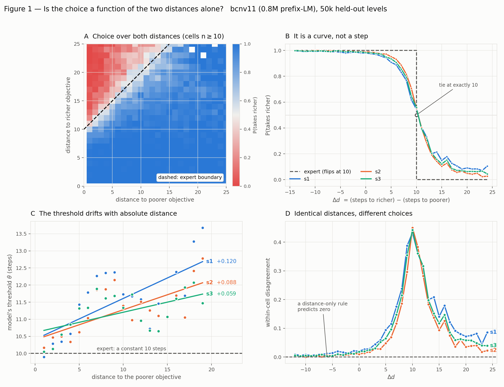
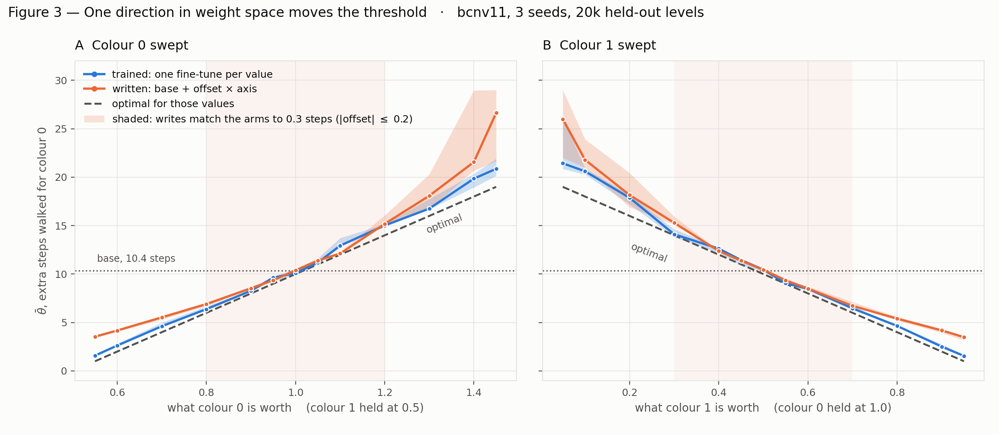
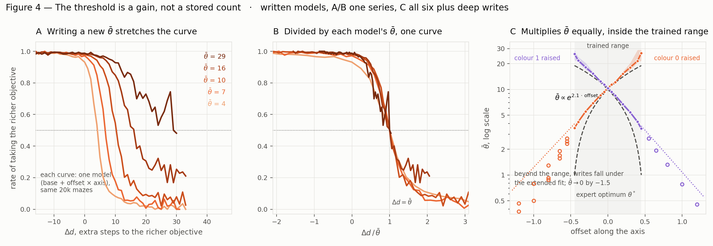

# The utility calculation performed by the model

`bcnv11` (0.8M prefix-LM, values hidden) should take the richer objective iff it
is less than $\theta^*$ steps further away, where $\theta^*$ is the value gap
over the step penalty:

$$\theta^* \;=\; \frac{v_0 - v_1}{p} \;=\; \frac{1.0 - 0.5}{0.05} \;=\; 10 \text{ steps}$$

**No discount.** The expert maximises $\text{value} - 0.05 \times \text{distance}$,
so $\theta^* = 10$ exactly. The DRC's optimum is the discounted ~9.3; nothing here transfers to it
without restating the reference.

We work through the assumptions one at a time, so that a later mechanistic
account has something to be accountable to.

---

## 1. Showing the model has an internal (noisy) binary threshold on difference in distance



Choice is a deterministic function of the whole level:

$$c_i = f(\text{level}_i)$$

where $c_i$ is 1 when the agent took the richer objective and 0 when it took the poorer one.

A **cell** is an exact pair $(d_{\mathrm{rich}}, d_{\mathrm{poor}})$; many
different mazes share one. Fixing the cell fixes both distances, which is what
lets the level's other properties be isolated.

### Expressing as a function of $\Delta d$

*Fig 1A*: the bands run diagonally. Knowing $d_{\mathrm{rich}}$ and
$d_{\mathrm{poor}}$ separately buys nothing over knowing their difference, so
the rule can be written as a threshold on that one number:

$$c_i = \mathbf{1}\!\left[\, \Delta d_i < \theta_i \,\right],
\qquad \Delta d_i = d_{\mathrm{rich},i} - d_{\mathrm{poor},i}$$

$\theta_i$ is **the model's** threshold on maze $i$, in steps: how much further
it will walk for the richer objective there. It is not the task's optimal
solution, which is $\theta^*$.

The reduction to $\Delta d$ is close but not exact. A small residual dependence
on the distances survives, and for now it is packed into $\theta_i$.

### Unpacking $\theta_i$

Split the threshold into a central value and a residual:

$$\theta_i = \bar{\theta} + \xi_i, \qquad \operatorname{med}(\xi) = 0$$

It is centred on the median rather than the mean because the median is what is
measured: $\bar\theta$ is where the curve crosses one half. The two would
coincide for a symmetric $\xi$; the upper tail is heavier, so the mean sits a
little above.

This gives:

$$\boxed{\;c_i = \mathbf{1}\!\left[\, \Delta d_i < \bar{\theta} + \xi_i \,\right]\;}$$

### $\bar\theta$: the model over-pursues value, slightly

```
θ̄     10.32,  10.34,  10.35   steps        against  θ* = 10
```

About a third of a step of over-pursuit, replicating across seeds. It is read
straight off *Fig 1B*: at $\Delta d = 10$ the model still takes the richer
objective on 54.5% of levels and at $\Delta d = 11$ on 40.5%, so it crosses one
half at 10.3.

This is small next to the spread below, so it is the lesser of the two
departures. It is also one-sided: 3% of mazes have $\xi > +14$ against 0.9%
below $-20$, so what over-pursuit there is lives in a heavy upper tail rather
than a displaced centre.

### $\xi$ is large

```
quantiles of θ            q25     q50     q75     IQR
s1                       8.12   10.32   12.62    4.50
s2                       8.61   10.34   12.39    3.78
s3                       8.29   10.35   12.61    4.32
```

**$\mathrm{IQR} \approx 4$ steps against $\bar\theta \approx 10.3$.** This is
the main departure from a clean threshold, an order of magnitude larger than
the bias above. *Fig 1B*: the crossing is gradual, not sharp.


### $\xi$ is not much of a function of distance

This is what step 1 left over. $\mathbb{E}[\xi_i \mid d_{\mathrm{poor}}]$
increases (the model walks further for the richer objective when both are far
away) by a summary slope of $+0.120$, $+0.088$, $+0.059$ steps per step across
seeds (*Fig 1C*), positive in all three.

That is ~2% of $\operatorname{var}(\xi)$. The sign is solid and the effect is
real, but the reduction to $\Delta d$ in step 1 loses very little. The linear
form is not established ($R^2 = 0.46$, and the relation is non-monotone), so
this stays a reported trend rather than a term in the equation.

### $\xi$ is a property of the level, not the network

```
corr(ξ⁽ˢ⁾, ξ⁽ˢ′⁾)    +0.297   +0.346   +0.256      shuffle null 0.000 ± 0.009
```

Where one seed departs from its cell majority, 61–66% of those levels are also a
departure for another seed, against a 9–10% base rate.


### $\xi$ is not explained by any feature we named

21 geometric and route-shape features (straight-line and Manhattan distance,
detour ratios, turns, non-closing steps, excursions, branch points, angle, edge
proximity), variance of $\xi$ explained:

| | geometry | route shape | both | random control |
|---|---|---|---|---|
| s1 | 0.0103 | 0.0068 | 0.0158 | 0.0018 |
| s2 | 0.0065 | 0.0026 | 0.0086 | 0.0020 |
| s3 | 0.0061 | 0.0054 | 0.0102 | 0.0015 |


---

## 2. Can the threshold be adjusted?

Part 1 established that the model carries a threshold. Can it be found in the
weights and moved?


### Fine tunes

An **arm** is 1000 fine-tune steps from the base on demonstrations generated at
shifted values; 25 per sweep, two sweeps (colour 0 moved, colour 1 moved),
three seeds.

Every arm is then decoded on the **same** held-out levels at the **base**
values.

### Fitting an axis

Each arm is a point in weight space, a displacement $\Delta w$ from the base.
Fit those displacements against the offset they were trained at:

$$\Delta w(\text{offset}) \;=\; \mathrm{drift} \;+\; \text{offset}\cdot\mathrm{axis}$$

An ordinary least-squares line, run simultaneously over all 806,533 parameters.
The two components are close to orthogonal: $\cos(\mathrm{drift}, \mathrm{axis})$
sits between $-0.10$ and $+0.09$ across all six sweeps.

The line is not a tight description of an arm, though. Splitting each arm's
displacement into the three pieces, for `bcnv11.s1`:

```
offset    |diff|   =  |drift|  +  |offset x axis|  +  |residual|
 ±0.05     1.53         1.15          0.14              1.16
 ±0.20     1.56         1.15          0.54              0.93
 ±0.45     1.65         1.15          1.21              0.78
```

**Most of what fine-tuning does has nothing to do with the axis.** At the
narrow end the value-dependent part is a tenth of the displacement and the
drift is eight times larger; only at the widest offsets do the two become
comparable. Across arms the affine fit accounts for about half the variance, an
$R^2$ of 0.50 to 0.55 in every sweep.

That looks like a weak model, yet the direction it recovers is highly
reproducible: fitting the axis on alternate offsets and comparing the halves
gives **0.95 to 0.96** in all six sweeps. Both can hold because the residual is
unstructured. It is large per arm but does not track the offset, so it averages
away in the fit while the drift is absorbed by the intercept.


### Writing using the axis

To show that the axis is what controls $\bar\theta$, and that the rest of the
weight changes are superfluous, we write it into the weights directly and ask
whether the result behaves like the fine-tuned model:

$$w \;=\; w_{\text{base}} \;+\; \text{offset}\cdot\mathrm{axis}$$




### The axis controls over a wide range

$\bar\theta$ goes where it is put, from **1.5 to 22 steps**. The top end is the
most this task can reliably express, because the maze size caps the gaps.
**We note that the axis fails when trying to write a negative value to $\bar\theta$.**
Part 3 explains why: within this range the axis acts multiplicatively, and the
multiplier never nears zero. Writes far outside the range behave differently;
see part 3.

Adjusting the richer objective up produces the same change in weights as
adjusting the poorer one down, and vice versa: in weight space the two sweeps'
axes are anti-parallel ($\cos(\mathrm{axis}_0, \mathrm{axis}_1) = -0.98$,
`028`). This is the value-side counterpart to part 1's finding that the two
distances enter only through their difference.

A norm-matched random direction does nothing at all:

```
base                         θ̄ = 10.45
axis × 0.20   |·| = 0.539    θ̄ = 16.13     random, same norm:  10.44, 10.42, 10.45
axis × 0.45   |·| = 1.213    θ̄ = 29.00     random, same norm:  10.48, 10.22, 10.54
```


## 3. How Is this Threshold Used Mechanistically? Multiplicatively.

Part 1's rule is a description of behaviour, not a mechanism. To ask what the
mechanism is, start from the task's own rule: take the richer objective iff the
extra value outweighs the extra walking,

$$v_0 - v_1 \;>\; p\,\Delta d$$

The model never sees $v$ or $p$ (values are hidden), so it must learn estimates. The inequality rearranges two ways, and each
suggests different mechanics.

**Option 1: divide first, compare in steps.** The division happens during training and
only the ratio of $\frac{v_0 - v_1}{p}$ is esimated in the model weights, as one stored quantity $b$, denominated in steps:

$$\frac{v_0 - v_1}{p} \;>\; \Delta d
\quad\leadsto\quad
c_i \;=\; \mathbf{1}\!\left[\, \Delta d_i \;<\; b \,\right]$$

The threshold you measure is the stored number itself: $\bar\theta = b$.

**Option 2: weigh the two sides.** Both stand-ins are estiated by the trained model, $b$
for the value gap and $g$ for the step price, and the decision is the sign of
the difference:

$$v_0 - v_1 - p\,\Delta d \;>\; 0
\quad\leadsto\quad
c_i \;=\; \mathbf{1}\!\left[\, b \;-\; g\,\Delta d_i \;>\; 0 \,\right]$$

Here neither $b$ nor $g$ is in units of steps and no "10" is stored anywhere;
the measured threshold is assembled from two components, $\bar\theta = b/g$.

Without noise the two are the same function, so no experiment on a fixed model
can separate them. Part 2's axis is what makes them distinguishable, because the noise described in
part 1 affects the behaviour of the axis. Whatever the
internals are, an edit that moves the crossing can treat that noise in only
two clean ways, and each leaves a fingerprint on the curve that holds for any
distribution the noise follows.

**Slide: the edit leaves the noise alone.** This is what editing Option 1's
stored count does, and equally what an additive shift to Option 2's $b$ does
while $\eta$ stays put. In Option 1's terms:

$$c_i \;=\; \mathbf{1}\!\left[\, \Delta d_i \;<\; b + \xi_i \,\right]
\qquad\Rightarrow\qquad
\bar\theta = b, \quad \xi_i \text{ untouched as } b \text{ moves}$$

The take-rate at gap $x$ is $P(\xi > x - b)$, a function of $x - b$ only, so
the curve translates rigidly. Every quantile keeps its distance from the
crossing: $q_{25} - \bar\theta$ and $q_{75} - \bar\theta$ are fixed across
models, whatever distribution $\xi$ follows.

**Stretch: the edit carries the wobble with it.** This is what scaling Option
2's gain does, since $b$ and $\eta$ are divided by the same $g$:

$$c_i \;=\; \mathbf{1}\!\left[\, b + \eta_i - g\,\Delta d_i \;>\; 0 \,\right]
\;=\; \mathbf{1}\!\left[\, \Delta d_i \;<\; \frac{b + \eta_i}{g} \,\right]
\qquad\Rightarrow\qquad
\bar\theta = \frac{b}{g}, \quad \xi_i = \frac{\eta_i}{g}$$

Lowering $g$ raises the crossing and every $\xi_i$ in proportion, so the curve
is a function of $\Delta d / \bar\theta$ and dilates about zero. Every
quantile keeps its ratio to the crossing: $q_{25}/\bar\theta$ and
$q_{75}/\bar\theta$ are fixed, again for any distribution of $\eta$, and
dividing each model's curve by its own $\bar\theta$ should collapse them onto
one master curve.

The machines map onto the fingerprints many-to-one, and saying so is what
keeps the test clean. Option 1 can only slide, under any edit of its count:
multiply $b$ instead of adding to it and the crossing moves multiplicatively,
yet the curve still slides, because the noise is a separate object in steps
that editing the count cannot reach. The fingerprint tracks the noise, not the
crossing. Option 2 can do either, sliding if the axis shifts $b$ and
stretching if it scales $g$.

The results check three things: which fingerprint the curves show, how the
crossing moves with the offset, and whether the per-maze error itself survives
the edit. Each curve in Fig 4 is one model, the base or a write, decoded on
the same 20,000 held-out mazes. A curve's crossing is that model's
$\bar\theta$ and its width is that model's $\xi$.



### The curve stretches

*Fig 4A/B*: dividing each model's curve by its own $\bar\theta$ collapses all
of them onto one master curve.

The figure shows one series; the numbers cover all twelve, 159 models with
$\bar\theta$ from 1.5 to 29:

```
stretch predicts fixed    q25/θ̄ = 0.72 ± 0.12      q75/θ̄ = 1.35 ± 0.14
slide predicts fixed      q25 − θ̄ trends from −1.6 (θ̄ = 3.6) to −12.5 (θ̄ = 29)
```

The ratios hold; the step offsets do not just vary more, they trend with
$\bar\theta$, which no fixed-in-steps noise can do. The stretch holds in both
directions (curves at $\bar\theta \approx 4$ are narrower than the base's,
which damage from fine-tuning cannot produce) and for the written models as
well as the trained arms.

This is the stretch fingerprint. We live in Option 2 with strong evidence against the additive stories.

The measurement itself was red-teamed: an isotonic fit instead of the first
crossing, bin floors of 25 or 100 levels, and dropping every model with
$\bar\theta > 20$ each move the ratio statistics by less than 0.02, and
holding $d_{\mathrm{poor}}$ to a fixed band leaves the collapse in place. So
neither the reading method, the ceiling, nor level composition is carrying the
result ([`results/utility-rule-gain-checks-bcnv11.txt`](results/utility-rule-gain-checks-bcnv11.txt)).

### The axis is log-linear inside its working range

*Fig 4C*: within the trained range, equal moves along the axis multiply
$\bar\theta$ by equal factors.

```
θ̄(offset) = θ̄₀ · e^(c·offset)     R² 0.986–0.998 across the six write series
                                  (linear: 0.89–0.97)
c            s1 2.31 / 2.26     s2 1.94 / 1.95     s3 2.13 / 2.19     (o0 / o1)
```

$c$ is a per-seed constant shared by both sweeps: the same axis seen from
either end, once again. It is not carried by the censored top writes: dropping
every model with $\bar\theta > 20$ moves $c$ by less than 0.12 and keeps
$R^2$ above 0.985. The arms are the contrast. For them linear wins
($R^2$ 0.99 against 0.91), because training pulls each arm to the expert's
$\theta^* = 10 + 20\cdot\text{offset}$. Fine-tuning lands wherever its data
puts it; the raw axis, extrapolated in weight space, moves $\log\bar\theta$
linearly.

This explains the failure noted in part 2: a multiplicative axis cannot cross
zero, so a negative $\bar\theta$ was never writable. It also shows the axis is
calibrated, with a local slope at the base of $\bar\theta\, c \approx 21$ steps
per unit of offset against the expert's 20.

The claim is scoped in both directions. It is not the trivial sense in which
any smooth curve is locally anything: the range spans a factor of eight in
$\bar\theta$, the curvature sits mid-range (the local slope more than doubles
between offsets $-0.2$ and $+0.2$), and a straight line misses the ends by
factors, so over this domain the multiplicative form is resolved against the
linear one, not assumed. And it does not extend: writes pushed below $-0.45$
keep falling, faster than the exponential predicts (s1: 1.29 at $-0.80$ and
0.79 at $-1.00$ against predictions of 1.63 and 1.03), so there is no floor
and no global exponential either. By $-1.5$ the write no longer moves a threshold cleanly at all, and the far
end is seed-specific: s1 grazes a small preference reversal
($\bar\theta = -0.35$ at $-2.00$, mirrored by its o1 sweep at $-0.44$) while
s2 and s3 bottom out near zero and turn back up, and the models degrade out
there (levels where any objective is reached fall from 97% to 72–79%). So
part 2's failure to write a negative $\bar\theta$ describes the clean
regime: within it the axis is multiplicative and never nears zero, and far
outside it the linear edit stops implementing the move rather than pushing it
through zero.

A product of per-layer factors $\prod_\ell (1 + c_\ell \cdot \text{offset})$
behaves exactly this way: close to $e^{c\cdot\text{offset}}$ while every
factor is near one, steeper than the exponential below, zero at a finite
offset, and past that a sign flip or a bounce depending on whether an odd or
even number of factors have crossed. Writing the axis one parameter block at a
time tests this directly, and it holds:

```
c_ℓ, single-block writes    block_0  block_1  block_2  block_3   embed   head     Σc_ℓ   full c
s1                            0.45     0.88     0.40     0.25     0.02   −0.00    2.01    2.31
s2                            0.61     0.50     0.45     0.18     0.03    0.00    1.76    1.94
s3                            0.66     0.62     0.43     0.15     0.05   −0.00    1.90    2.13
```

- **The move is carried by the four transformer blocks and nothing else.**
  Embeddings and head do nothing written alone (and hold under 1% of the
  axis's squared norm), while every block moves the threshold the same way.
  Which block carries most differs by seed; the behavioural axis does not.
- **The log shifts add.** At $\pm 0.20$ the sum of the four single-block
  shifts lands within 12% of the full write's $\log\bar\theta$ shift
  (88–107% across the six seed-offset pairs), with the full write mildly
  larger than the sum at $\pm 0.45$.
- **The deep-write split follows the factor structure.** The first factor
  zeroes near $-1/c_{\max}$: $-1.1$ for s1 against $-1.5$ and $-1.7$ for s3
  and s2. s1, whose largest factor stands alone (0.88 against 0.45), is the
  seed that crossed zero; s2 and s3, whose top two factors are nearly equal
  (0.61/0.50 and 0.66/0.62), are the seeds that bounced, as an even number of
  crossed factors predicts. The crossing locations are ordinal rather than
  exact (s1 crossed near $-1.55$, not $-1.1$); the block rates are themselves
  in-range fits.

On its own this result would not decide the machine, since a multiplied stored
count also moves the crossing exponentially and never through zero. Combined
with the stretch it completes the picture: the axis multiplies the whole
comparison, noise included.

### The misread is per-maze, and the axis leaves it alone

If each level carries a fixed fractional misread, raising $\bar\theta$ can only
add levels to the taken set. Between the base and each o0 write, backward flips
are **1–5% of forward flips** (s1 at $+0.20$: 3,787 forward, 91 backward),
rising gently with the size of the edit. This is the same object as part 1's
cross-seed $\xi$ correlation, a property of the maze, now shown to survive
edits as well.

### The calculation, pieced together

$$\boxed{\;c_i = \mathbf{1}\!\left[\, \Delta d_i \,(1+\varepsilon_i) \;<\; G \,\right],
\qquad \log G \text{ linear in the offset}\;}$$

Each maze's gap is read with a fractional error $\varepsilon_i$, a fixed
property of that maze, and compared against a quantity $G$ whose log the axis
moves. What the data settles is the structure: the axis's action and the
per-maze error are both multiplicative, and no additive version of either
survives. Part 1's residual is $\xi_i \approx -\bar\theta\,\varepsilon_i$,
proportional to the threshold, with the per-maze constant $\varepsilon_i$
underneath it.

One question behaviour cannot decide: which internal quantity the axis
multiplies. "The axis lowers $g$", "the axis raises $b$ and $\eta$ in
proportion", and "a count $b$ in steps, multiplied by the axis and compared
against a proportionally misread gap" produce identical observables, because a
common rescaling ($b, g, \eta \to \alpha b, \alpha g, \alpha\eta$) changes
nothing a choice can reveal. The boxed equation is deliberately neutral about
where $\varepsilon$ and $G$ live, and even whether a step-denominated number
exists inside the model is gauge. Settling it needs activations, where these
are actual numbers. That is the next experiment rather than a missing
analysis.

Two limits of the measurement: a small additive noise floor cannot be excluded,
since integer gaps put the resolution near one step; and above
$\bar\theta \approx 20$ the mazes cannot express the gaps needed to see the
whole curve, which is why the top writes crowd toward $\bar\theta \approx 29$.

---

## Provenance

| | |
|---|---|
| numbers | [`results/utility-rule-bcnv11.txt`](results/utility-rule-bcnv11.txt) (parts 1-2), [`results/utility-rule-gain-bcnv11.txt`](results/utility-rule-gain-bcnv11.txt) (part 3) |
| data | `figures/data/h1/`: per-level decodes (3 seeds), level features. `figures/data/h1/grid/`: 159 models of the value-axis grid. `figures/data/h1/deep/`: writes beyond the trained range. `figures/data/h1/masked/`: single-block writes |
| rebuild | `scripts/utility_rule_report.py`, `scripts/gain_knob_report.py`, `scripts/gain_knob_checks.py`, `figures/make_distance_rule.py`, `figures/make_axis_dial.py`, `figures/make_gain_knob.py` |
| decode | `scripts/decode_h1.py` (part 1, 50k), `scripts/decode_grid.py` (part 2, 20k), `scripts/decode_written.py` (deep writes), `scripts/decode_masked.py` (single-block writes), on `offline/demos/test.rho100` |

**Method note: read the curve, do not fit it.** A logistic fitted over the full
gap range has misled three times here, always the same way: about 80% of levels
sit where the choice is saturated, the tails do not match a logistic, and the
fit pays for them by distorting the middle. It understated the dependence on
absolute distance (reversed once refitted on gaps 6–16 and per
$d_{\mathrm{poor}}$), it put the $\mathrm{IQR}$ at 6.58 against a measured
4.50, and it placed the crossing at 11.10 against a measured 10.32, turning a
third of a step of over-pursuit into a whole one. Every number above is read
off binned rates instead.

[`CLAIMS.md`](CLAIMS.md) · [`Experiment2.md`](Experiment2.md)
